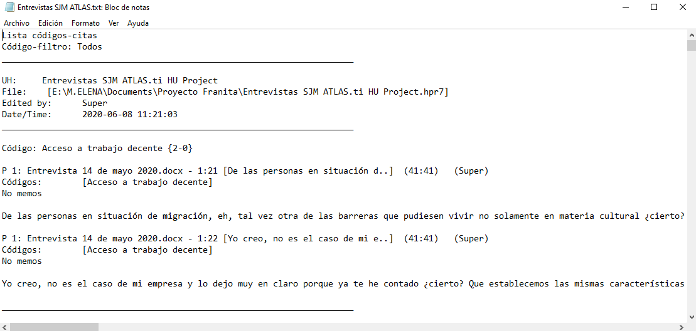
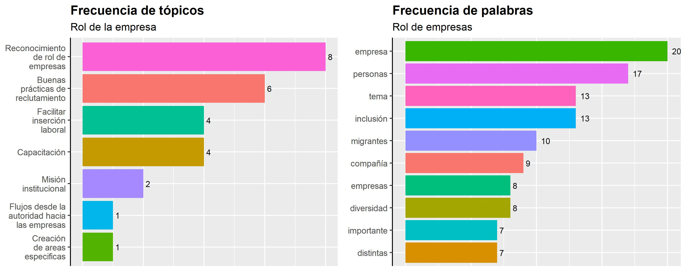
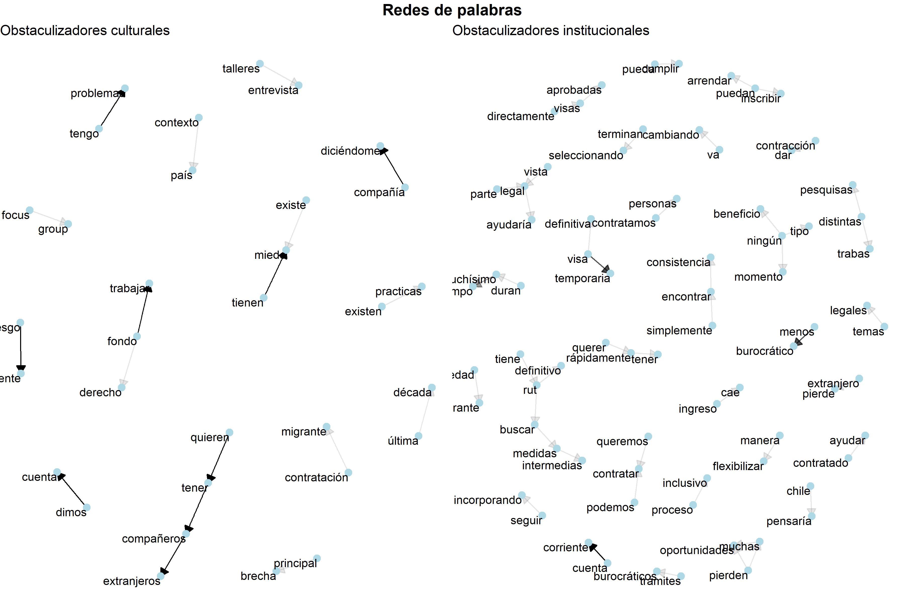

# text-mining-SJM-Atlas.Ti-y-R

<b>¿Cómo extraer la codificación abierta realizada en Atlas.Ti para convertirla en un data frame?</b>

El siguiente ejemplo se realiza utilizando entrevistas a representantes de 3 empresas que forman parte de la Red de Empresas Interculturales coordinada por el Servicio Jesuita a Migrantes. La realización de dichas entrevistas buscó indagar en las percepciones y opiniones de los entrevistados en relación a dos grandes materias:

•	Cuáles son las brechas para la inclusión laboral de las personas migrantes en Chile,
•	Cuáles son las propuestas de los entrevistados para mejorar la inclusión laboral, que debieran ser consideradas en la formulación de un Política Nacional de Migración.

El análisis de contenido de dichas entrevistas se realizó mediante el programa Atlas.Ti. ATLAS.TI corresponde a programa para el análisis cualitativo que permite albergar y organizar en una <b>Unidad hermeneutica</b> un conjunto de <b>documentos primarios</b> diversos (texto, fotografías, audio, video, etc.). El programa permite destacar segmentos de dichos documentos que resultan significativos para el fenomeno que se estudia, constituyendo <b>códigos</b> descriptivos. A su vez, dichos códigos pueden agruparse en categorías que dan cuenta de un nivel de abstracción más alto, llamadas <b>familias</b>. 

En la barra lateral se observa a modo de ejemplo los códigos asociados a los segmentos de texto que se presentan en el cuerpo del documento primario.

El programa permite exportar en .txt un listado de códigos y citas asociadas a la Unidad hermeneutica, en un archivo que identifica cita, código, y familia, si es que corresponde.

El archivo descargable, presenta una serie de patrones a los cuáles es factible recurrir, para extraer aspectos de nuestro interes y conformar un data frame. Por ejemplo, en base a patrones nos permitirán extraer el código, la familia a la que pertenece y el segmento del documento primario asociado (en este caso, una cita de texto) en un data frame con dichas columnas:

<table class="table" style="margin-left: auto; margin-right: auto;">
 <thead>
  <tr>
   <th style="text-align:left;"> codigo </th>
   <th style="text-align:left;"> familia </th>
   <th style="text-align:left;"> frase </th>
  </tr>
 </thead>
<tbody>
  <tr>
   <td style="text-align:left;"> Avance disruptivo {1-0} </td>
   <td style="text-align:left;"> Obstaculizadores culturales </td>
   <td style="text-align:left;"> creo que Chile en materia de diversidad definitivamente ha avanzado mucho en la última década, pero también digamos ese avance disruptivo y rápido de la última década, ha puesto a muchas personas que talvez tienen una mentalidad mucho más tradicional en una encrucijada de lo distinto </td>
  </tr>
  <tr>
   <td style="text-align:left;"> Brechas de formación profesional {1-0} </td>
   <td style="text-align:left;"> Rol de la empresa </td>
   <td style="text-align:left;"> Es un tema, el tema del visado es súper complejo y tiene un lenguaje la verdad bien jurídico, entonces la gente que trabaja en selección son psicólogos eh.. y finalmente los psicólogos no temenos obviamente una formación de base que nos ayude a ver este tema más general, nosotros en Walmart tenemos un área que se encarga de.. se llama movilidad global y extranjería, y ellos se encargan de ver lo del visado de las personas que ingresan a la compañía, entonces cuando se nos levanta, </td>
  </tr>
  <tr>
   <td style="text-align:left;"> Burocracia e ineficiencia {7-0} </td>
   <td style="text-align:left;"> Obstaculizadores institucionales </td>
   <td style="text-align:left;"> Que puede hacer que los procesos, no sean efectivamente tan finos, no sean tan efectivos y creo que allí está la oportunidad de entender, el desarrollo. </td>
  </tr>
  <tr>
   <td style="text-align:left;"> Burocracia e ineficiencia {7-0} </td>
   <td style="text-align:left;"> Obstaculizadores institucionales </td>
   <td style="text-align:left;"> El departamento de extranjería, esta con millones de solicitudes por ende las 48 horas, se transforman en una semana, y las personas se empiezan a atochar en el departamento de extranjería ya, finalmente es algo súper denigrante también ver a los migrantes con su hijo en el fondo pernoctando toda la noche, esperando que los atiendan, la gente en la entrada no es muy amigable, me ha tocado ir en el fondo al departamento de extranjería y uno ve, como está la gente en la calle acostada esperando que la vayan a atender en el departamento de extranjería, la verdad ha sido bien caótico acá el tema de validar el tema de las visas. </td>
  </tr>
  <tr>
   <td style="text-align:left;"> Burocracia e ineficiencia {7-0} </td>
   <td style="text-align:left;"> Obstaculizadores institucionales </td>
   <td style="text-align:left;"> yo creo que los principales desafíos con que se encuentra la población migrante tienen que ver un poco con el acceso a los papeles en regla y la facilidad para poder tener estos papeles en regla y trabajar de manera legal, por así decirlo. Obtener un Rut, poder abrir una cuenta corriente para que le depositen el sueldo, por supuesto, los permisos de trabajo, o las visas para poder hacerlo eso lleva muchísimo tiempo. En mi época, 7 años atrás, a mí me llevo por lo menos un año y medio, siendo parte del Mercosur y hoy en día colegas o personas que contratamos dentro de la compañía, tal vez están tardando entre dos y tres años, para tener los papeles en regla, incluso por ejemplo: el pedido de visa en trámite, también hay un vacío legal que no los cubre del todo, entonces yo creo que la parte institucional tendría que tener un poquito más de agilidad para que les permita a ellos poder acceder rápidamente y que no caigan en infracciones, porque a veces uno justamente por migrar, por querer rápidamente tener un ingreso, cae en trabajos que no necesariamente se valoran por el tipo de estudios que tienen o por la trayectoria, sino que simplemente por tener un ingreso y eso desvaloriza mucho; la parte legal ayudaría. </td>
  </tr>
</tbody>
</table>

<b>Frecuencia de tópicos y palabras</b>

Las familias, en Atlas.Ti, corresponden a categorías que el investigador va construyendo mediante la agrupación de códigos descriptivos, constituyendo los tópicos o temáticas que aborda el documento primario en cuestión. En este caso, al convertir el listado de códigos y citas exportable en .txt desde Altas.Ti en un data frame mediante RStudio, podemos generar gráficas personalizadas que nos permitan conocer la cantidad de segmentos de texto que cada una de las familias posee.

Asimismo, al tokenizar el texto, podemos conocer la frecuencia que tiene cada palabra en el cuerpo del texto. 

La siguiente gráfica es un ejemplo de presentación conjunta de la frecuencia de tópicos (las familias de Altas.Ti) y la frecuencia de palabras en el conjunto de citas asociado a dichos tópicos. 

<b>Análisis de n-gramas</b>

El análisis de n-gramas nos permite conocer cuáles son las co-ocurrencias entre palabras más frecuentes y que tipo de redes de palabras conforman. Cada conjunto de palabras relacionadas entre ellas con flechas, muestran las relaciones que se establecen entre palabras mediante nodos y aristas. Los enlaces entre dos nodos del bigrama serán más o menos transparentes según la frecuencia en la que aparecen en el texto, destacándose con una flecha más oscura cuando se trata de bigramas recurrentes. Solo se graficó los bigramas con frecuencia igual o superior a 2.

De esta manera, en el caso de los obstaculizadores culturales, los bigramas más frecuentes corresponden a “Tengo --> Problemas”, “Sesgo --> Inconsciente”, “Tienen --> Miedo --> Existe”, como se observa en la oscuridad de las aristas que une cada nodo. Como se observa en los tres bigramas recién mencionados, los nodos de llegada tienen una connotación claramente negativa (problemas, miedo). 

Para el caso de los obstaculizadores institucionales, entre los bigramas más frecuentes predominan referencias a trámites como “visa --> temporaria” y “cuenta --> corriente”, los que por si solos tienen una connotación neutral. Le siguen los bigramas “Menos --> Burocrático” y “Muchísimo --> Tiempo”, lo que ya permite intuir que la percepción predominante en relación a los trámites antes mencionados es más bien critica, al predominar en una red junto a conceptos que hacen referencia lentitud y burocracia.

Si bien con menor frecuencia, destaca la unión entre varios bigramas debido a que comparten alguno de sus nodos en la red. Esto sucede con las siguientes palabras: “Tiene – Rut – Definitivo – Buscar – Medidas – Intermedias”, “Parte – Legal – Vista – Ayudaría”, “Ningún – Tipo – Beneficio – Momento”. Estos bigramas refuerzan que las principales inquietudes se asocian a procesos legales y administrativas (Rut definitivo, “parte legal”) que se perciben como deficientes, lo que se expresa en la necesidad de “medidas intermedias” o la conjugación condicional del verbo “ayudar”.

